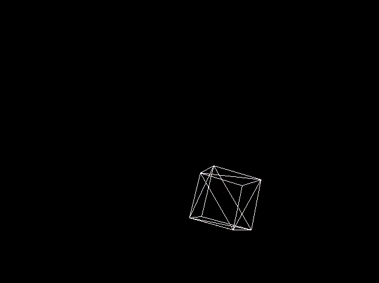
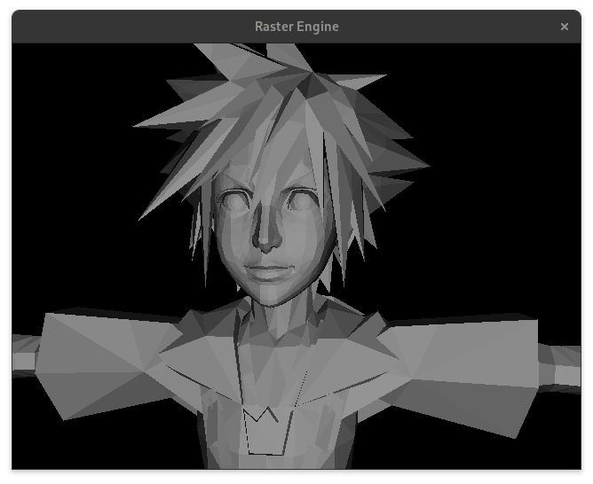
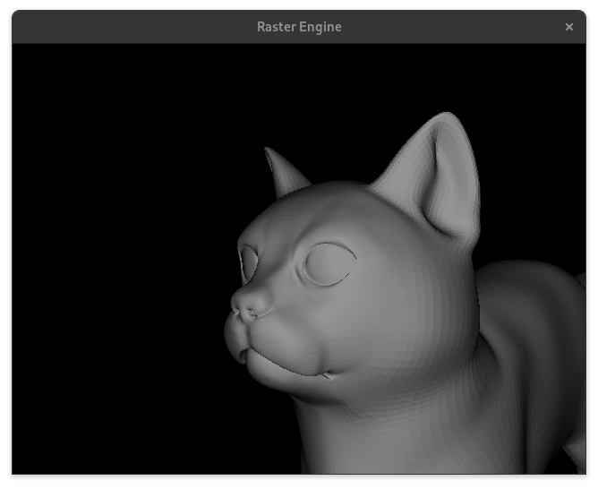

# Raster3D
A 3D render engine from scratch, using CUDA/C++.

<!---->
| Perspective Projection, and Rotation, demonstrating coordinate transforms.  | Flat Shading on Surfaces of Complex Polygons |
|---|---|
|  |  |


## Getting Started

Ensure you meet the requirements before attempting to build and run.

Cloning the repository:
```
git clone https://github.com/Sundance636/Raster3D.git
```

### Prerequisites

+ CUDA-Compatible GPU (Nvidia to play it safe)
+ [CUDA-toolkit](https://developer.nvidia.com/cuda-toolkit)
+ [SDL2 libs](https://www.libsdl.org/)


### Linux

Using your package manager of choice install the required packages
#### Arch Linux

```
sudo pacman -S cuda && sudo pacman -S sdl2
```

Once the packages are installed, go to the root of the repo and run the makefile, running `make` will just build the project while `make profile` will build and run with `nvprof` to profile the runtime:
```
make profile 
```
You can manually Run the executable with:
```
./Engine 
```

<p></p>


### Windows
(Coming soon, probably)

## Usage

When the program is started you will be presented to a scene where the camera is centered at the origin, you may move around to observe, and the terminal continuously will display some information about the current scene.

| Controls | |
|---|---|
|Arrow Keys | Pan the camera in the respective direction |
| W| Rotate camera up|
| A | Rotate camera left|
| S| Rotate camera down|
|D| Rotate camera right|
|E| Move camera forward|
|Q| Move camera backwards|
(More options and user controls coming soon)


## Examples

https://github.com/Sundance636/Raster3D/assets/83687182/bc8d2ae8-a1ea-41dd-8a91-cdc58bf75dbe

**High Poly Cat**

 

